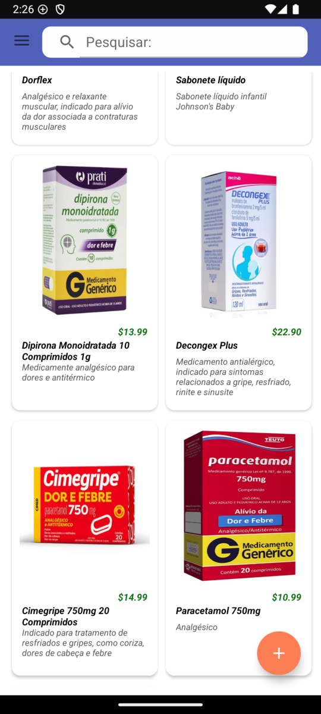
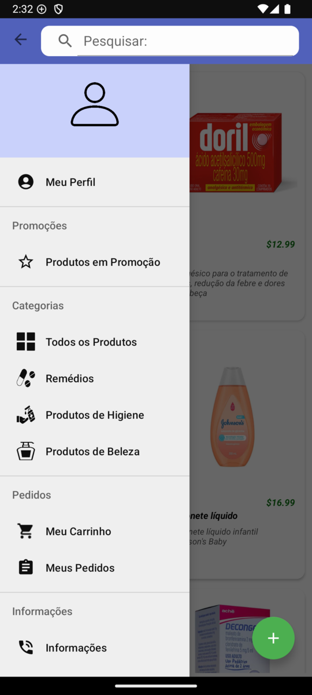
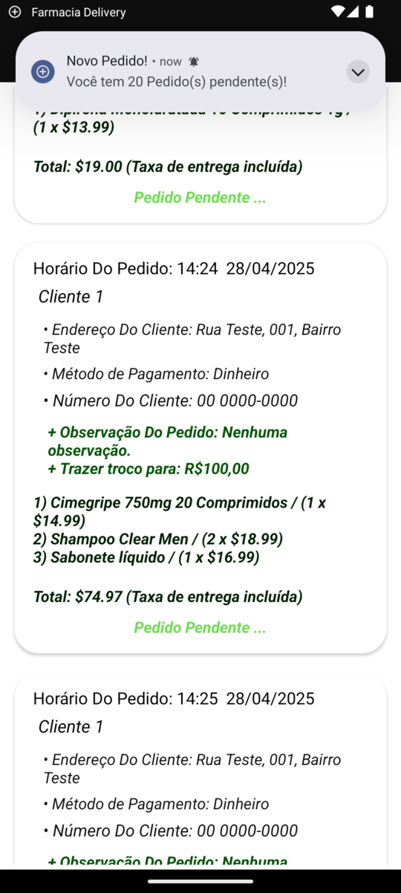
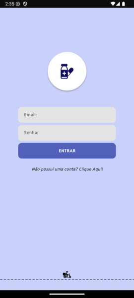

# 💊 Aplicativo Farmácia Delivery

Aplicativo Android nativo destinado a estabelecimentos que buscam facilitar o processo de venda e entrega de seus produtos.
Por meio deste app, o usuário pode realizar pedidos de forma prática e intuitiva, proporcionando ao proprietário uma gestão mais eficiente das vendas e entregas.

## 🚀 Funcionalidades

✅ Cadastro de produtos

✅ Filtro de produtos por categorias e barra de pesquisa

✅ Informações que formam cada item adicionado:
- Nome do produto que será exibido para os clientes
- Descrição do produto
- Preço do produto
- Imagem ilustrativa do produto
- Categoria do Produto

✅ Categorias personalizadas para cada produto adicionado:
- Remédios, Higiene Pessoal, Produtos de Beleza, Outros.

✅ Notificações em tempo real, histórico de pedidos e confirmação de entrega.

✅ Cadastro/Login de usuários através de email e senha

✅ Fácil de utilizar, buscando a melhor experiência possível do usuário ao utilizar o app.

## 🛠️ Stack Tecnológica utilizada neste projeto

- **Java** — Linguagem principal utilizada para o desenvolvimento do aplicativo.
- **Firebase Realtime Database** (20.2.2) — Para salvar e gerenciar dados de forma em tempo real.
- **Firebase Authentication** (22.1.1) — Para cadastro e login de usuários (clientes e empresa).
- **Firebase Storage** (20.2.1) — Para o armazenamento de imagens dos produtos.
- **Arquitetura MVC(Model-View-Controller)** — Melhor separação de responsabilidades.
- **XML** — Para a construção da UI.

## 📫 Contato

- Email: gustavoteixeira.ggt@gmail.com
